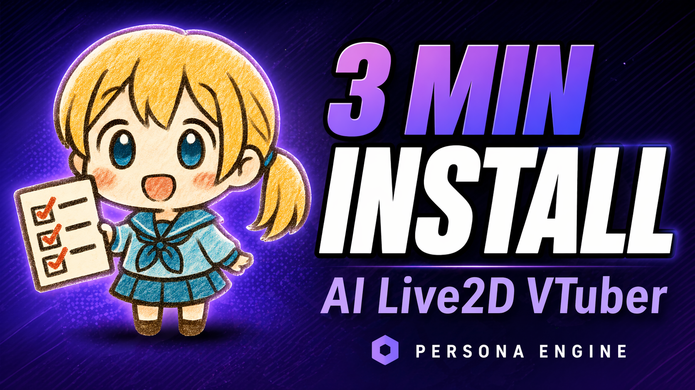

<div align="center">
<h1>⚙️ Installation &amp; Setup Guide ⚙️</h1>

<p>Get your Live2D avatar talking in a few minutes.</p>
</div>

> [!NOTE]
> For a feature overview, see the main [README.md](./README.md). For the full
> `appsettings.json` field reference, see [CONFIGURATION.md](./CONFIGURATION.md).

---

## 📜 Contents

- [Requirements](#requirements)
- [Quick start](#quick-start)
- [Choosing an install profile](#install-profiles)
- [Turning on the better models after a Build-with-it install](#upgrade-models)
- [CLI flags](#cli-flags)
- [Configure your LLM (required)](#configure-llm)
- [Configure your personality (required)](#configure-personality)
- [Viewing the avatar](#viewing-avatar)
- [Building from source](#build-from-source)
- [Upgrading from a pre-installer build](#upgrading)
- [Troubleshooting](#troubleshooting)
- [Still stuck?](#still-stuck)

---

## <a id="requirements"></a>🧰 Requirements

| | |
|---|---|
| **OS** | Windows 10 or 11, 64-bit. |
| **GPU** | NVIDIA with CUDA support. AMD, Intel and CPU-only are **not** supported. |
| **Disk** | ~16 GB free on the drive where you extract the release (profile-dependent — see below). |
| **Network** | Internet access the first time you launch, so the installer can download models. |
| **Microphone + speakers/headphones** | Required for voice interaction. |

That's it. **You do not need to install CUDA, cuDNN, the .NET runtime, espeak-ng, or Whisper models yourself** — the release is self-contained and the built-in installer downloads every model and native runtime it needs on first run, SHA-256-verified against the canonical manifest.

---

## <a id="quick-start"></a>🚀 Quick start

> [!IMPORTANT]
> **3-minute install walkthrough**
>
> <a href="https://youtu.be/3WLPXKvDaDk" target="_blank">
>   
> </a>
>
> Prefer to watch than read? This covers everything below, end-to-end.

1. Grab the latest `PersonaEngine-<version>-win-x64.zip` from the [Releases page](https://github.com/fagenorn/handcrafted-persona-engine/releases/latest).
2. Extract it somewhere simple (e.g. `C:\PersonaEngine`). **Avoid** `C:\Program Files`, `C:\Windows`, and OneDrive-synced folders.
3. Double-click `PersonaEngine.exe`.
4. A console window appears with a profile picker — pick one of **Try it out**, **Stream with it**, or **Build with it** ([details below](#install-profiles)). The installer then downloads and verifies the matching models + NVIDIA runtime.
5. When install finishes, the main app window opens. Open the built-in **overlay** from the dashboard to see your avatar on your desktop — no OBS needed.
6. Open the **LLM Connection** panel and fill in your endpoint / model / API key ([see below](#configure-llm)). You're ready to talk.

---

## <a id="install-profiles"></a>🎚️ Choosing an install profile

On first run (or when you pass `--reinstall`) the installer offers three profiles. Each profile is a **superset** of the previous one, so it's fine to start small and upgrade later.

| Profile | What you get | Approx. download |
|---|---|---|
| **Try it out** | The avatar talks, listens, lip-syncs, shows subtitles, bleeps profanity, and outputs cleanly to OBS (Spout) for recording/streaming. | ~3 GB |
| **Stream with it** | Everything in Try it out **plus** RVC voice cloning (real-time voice conversion) and a starter voice pack you can swap between on the fly. | ~4 GB |
| **Build with it** | Everything in Stream with it **plus** the Qwen3 expressive TTS voice, Audio2Face realistic lip-sync, Whisper Turbo speech recognition, screen vision, and background-music / vocals separation. | ~16 GB |

Actual sizes are computed from the install manifest and shown in the picker. If you pick **Stream with it** today and decide later you want the full kit, run `PersonaEngine.exe --reinstall` and pick **Build with it** — previously-downloaded assets aren't re-fetched.

> [!IMPORTANT]
> The **Build with it** profile *downloads* the fancy models but doesn't *activate* them. The app defaults to the lighter Try-it-out stack so the experience is the same on every profile until you flip the switches yourself. See the next section.

---

## <a id="upgrade-models"></a>✨ Turning on the better models after a Build-with-it install

Open the **control panel** that comes up with the app. Three switches unlock what the bigger profile pulled down:

| Feature | Panel | What to click | Effect |
|---|---|---|---|
| **Expressive TTS** (Qwen3) | **Voice** | In the mode selector at the top, pick **Expressive** (the alternative is **Clear**, which is the default Kokoro voice). | Persists to `Config.Tts.ActiveEngine = "qwen3"`. Swaps the TTS engine live. |
| **Accurate speech recognition** (Whisper Turbo) | **Listening** → *Recognition* card | In the decoder-preset chips, pick **Accurate** (chips are **Fast** / **Balanced** / **Accurate**). | Persists to `Config.Asr.TtsMode = 2` (Precise). |
| **Realistic lip-sync** (Audio2Face) | **Avatar** → *Lip-Sync* card | In the Style chips, pick **Realistic** (the alternative is **Simple**, which is the default VBridger phoneme lip-sync). | Persists to `Config.LipSync.Engine = "Audio2Face"`. Sub-options (e.g. GPU solver) appear only when Realistic is selected. |

All three are live edits — they write through to `appsettings.json` immediately, no restart needed.

The **Vision** (screen awareness) feature is separate: it needs a vision-capable LLM endpoint which you configure in **LLM Connection** → *Vision LLM*. The Build-with-it profile ships the screen-capture machinery but you bring your own vision model.

---

## <a id="cli-flags"></a>🏳️ CLI flags

Pass these to `PersonaEngine.exe` from a terminal or a shortcut's target field.

| Flag | Purpose |
|---|---|
| `--profile=try\|stream\|build` | Skip the profile picker and use the named profile. |
| `--reinstall` | Re-run the profile picker on a machine that's already installed. Previously-downloaded assets are reused when still valid. |
| `--repair` | Re-download anything that fails SHA-256 verification. Use this if a file was truncated or corrupted. |
| `--verify` | Re-hash every installed asset and report mismatches **without** re-downloading. Read-only; good for "is my install healthy?". |
| `--offline` | Refuse to touch the network. Fails fast if anything required is missing. Useful when you know everything is in place and you don't want surprise downloads. |
| `--non-interactive` | Treat any prompt as a fatal error. Combine with `--profile=...` for unattended installs. |
| `--skip-gpu-check` | Bypass the NVIDIA-GPU gate. Escape hatch for unusual setups; the app still needs CUDA at runtime. |

---

## <a id="configure-llm"></a>🧠 Configure your LLM (required)

Persona Engine connects to **any OpenAI-compatible chat completions endpoint** — cloud providers (Groq, OpenAI, Together AI, Anthropic via proxy…) or local runners (Ollama, LM Studio, Jan, llama.cpp server) via their `/v1` endpoint or a LiteLLM proxy.

The easiest way is the **LLM Connection** panel in the app:

1. **Text LLM** section — set your endpoint URL, model identifier, and API key (leave blank if none).
2. Click **Probe** to check that the endpoint answers and the model exists. Green status = you're wired up.
3. *(Optional)* **Vision LLM** section — same but for the screen-awareness feature.

Or edit `appsettings.json` directly:

```jsonc
"Llm": {
  "TextApiKey": "gsk_...",                     // blank for local endpoints that don't require auth
  "TextModel": "llama-3.1-8b-instant",
  "TextEndpoint": "https://api.groq.com/openai/v1",
  "VisionApiKey": "",
  "VisionModel": "qwen2.5-vl-3b-instruct",
  "VisionEndpoint": "",
  "VisionEnabled": false
}
```

Changes hot-reload — no restart needed.

---

## <a id="configure-personality"></a><a id="configure-personality-txt---important"></a>📝 Configure your personality (required)

The file that tells the LLM *who* your avatar is lives at `Resources/Prompts/personality.txt` inside the extracted folder. You have two options:

**Option A — edit in the app (recommended):** open the **Personality** panel, write your prompt in the editor, and hit save. Changes take effect on the next turn.

**Option B — edit the file directly:** open `Resources/Prompts/personality.txt` in a text editor, rewrite it for your character, save.

The shipped default is optimized for a specific fine-tuned model. If you're using a standard LLM (Groq, Ollama, OpenAI, …), **rewrite the file** or you'll get lackluster responses. The repository root contains [`personality_example.txt`](https://github.com/fagenorn/handcrafted-persona-engine/blob/main/personality_example.txt) as a starter template for standard models — copy its contents into `personality.txt` and customize.

---

## <a id="viewing-avatar"></a>📺 Viewing the avatar

You have two ways to see your avatar. Pick whichever fits your setup.

### Option 1 — Built-in desktop overlay (simplest)

Persona Engine ships a transparent, always-on-top overlay window that mirrors the avatar right on your desktop. **No OBS, no plugins, no window chrome.**

- Open the **Overlay** panel in the app.
- Toggle **Enabled** on. The overlay appears.
- Hover it to reveal a thin border — drag it to move, drag the corners to resize.
- **Reset position** / **Reset size** buttons if you lose it off-screen.

### Option 2 — Spout into OBS (for streaming)

If you're streaming or recording, Persona Engine also broadcasts its render targets via **Spout**:

1. Install [OBS Studio](https://obsproject.com/).
2. Install the [Spout2 Plugin for OBS](https://github.com/Off-World-Live/obs-spout2-plugin/releases) matching your OBS version.
3. In OBS, add a source → **Spout2 Capture**.
4. Pick the sender from the dropdown: **`Live2D`** for the avatar, **`RouletteWheel`** for the optional wheel. Both sender names and resolutions are configurable in `appsettings.json` under `Config.SpoutConfigs`.

If the Spout dropdown in OBS is empty, Persona Engine either didn't start cleanly or the plugin isn't loaded — check the app's console log first.

---

## <a id="build-from-source"></a>🛠️ Building from source

For developers who want to modify the engine. The in-app installer still runs on first launch just like a release build.

**Prerequisites:**

- [Git](https://git-scm.com/)
- [.NET 9 SDK](https://dotnet.microsoft.com/download/dotnet/9.0)
- Windows 10/11 x64 with an NVIDIA GPU

**Steps:**

```bash
git clone https://github.com/fagenorn/handcrafted-persona-engine.git
cd handcrafted-persona-engine/src/PersonaEngine

# One-time: restore the local CSharpier formatter
dotnet tool restore

# Seed a working config (template has blank API keys — fill them in)
cp PersonaEngine.App/appsettings.template.json PersonaEngine.App/appsettings.json

# Build and run
dotnet build PersonaEngine.sln
dotnet run --project PersonaEngine.App
```

On first run you get the same profile picker as the release build. The installer drops models into `src/PersonaEngine/PersonaEngine.App/bin/Debug/net9.0/Resources/` (or the equivalent for your build config). Pass `--offline` if you've seeded that tree manually and don't want the bootstrapper to touch the network.

---

## <a id="upgrading"></a>♻️ Upgrading from a pre-installer build

The on-disk layout changed when the in-app installer landed. If you have a pre-installer install:

1. Back up `appsettings.json` and any custom Live2D models in `Resources/Live2D/Avatars/`.
2. Extract the new release into a **fresh** folder.
3. Run it. The installer populates the new `Resources/` tree with hash-verified assets; your old `Resources/Models/` and `Resources/Live2D/Avatars/` from the previous build **are ignored**.
4. Once the new install is happy, you can delete the old folder to reclaim ~16 GB.

---

## <a id="troubleshooting"></a>🛠️ Troubleshooting

The installer is the most common failure point on a fresh machine. Everything below assumes a normal release install.

- **"SHA-256 mismatch" / "hash verification failed"**
  - *Cause:* the downloaded file was corrupted or truncated (flaky connection, antivirus rewriting files).
  - *Fix:* run `PersonaEngine.exe --repair`. It re-downloads only the mismatched assets.

- **"Could not reach huggingface.co" / "Could not reach developer.download.nvidia.com"**
  - *Cause:* the installer couldn't reach the model host — usually firewall, corporate proxy, DNS, or the host is down.
  - *Fix:* check the URL in a browser from the same machine. If it loads there but not in the installer, you likely have a proxy that needs configuring at the OS level. If it's down, wait and retry.

- **"Disk full" / "Not enough space"**
  - *Cause:* fewer than ~16 GB free on the target drive (Build with it); Stream with it still needs ~4 GB.
  - *Fix:* free up space and rerun. Previously-completed downloads aren't re-fetched.

- **"NVIDIA GPU not detected" on launch**
  - *Cause:* CUDA isn't usable (no NVIDIA card, or driver install is broken).
  - *Fix:* install the latest [NVIDIA driver](https://www.nvidia.com/Download/index.aspx) and reboot. If you're sure your card works and the gate is just wrong, `--skip-gpu-check` bypasses the check — the app will still fail at runtime if CUDA isn't actually available.

- **"Another installer is already running"**
  - *Cause:* a lock file from a previous crashed install is still in `Resources/`.
  - *Fix:* make sure no `PersonaEngine.exe` is running in Task Manager, then rerun. The lock is a directory lock only — it's released on a clean exit.

- **Install finishes but the app won't start**
  - Run `PersonaEngine.exe --verify` from a terminal to check every installed asset's hash without re-downloading. If it reports mismatches, follow up with `--repair`.
  - If verify is clean, the failure is post-install. Check the console window and the `logs/` folder next to the exe.

- **LLM errors ("model not found", "401 unauthorized", "rate limited")**
  - The installer doesn't control the LLM — these come from your provider. Use the **Probe** button in the LLM Connection panel to confirm endpoint + model + key are right.

- **Avatar doesn't appear in the overlay**
  - Toggle **Enabled** off and back on in the Overlay panel — the state machine allows a retry from the failed state.
  - If it's still failing, check the dashboard's presence strip for the status chip. Full error detail is in the console and `logs/`.

---

## <a id="still-stuck"></a>🆘 Still stuck?


Join the [Discord community](https://discord.gg/p3CXEyFtrA). When you ask for help, please include:

- What profile you picked (Try / Stream / Build) and the exact error from the console.
- Your Windows version and NVIDIA GPU model.
- The LLM you're connecting to.
- Whether `PersonaEngine.exe --verify` reports mismatches.

---

## <a id="back-to-main-readme"></a>🔗 Back to main README

➡️ Return to [README.md](./README.md) for project overview and features, or dive into [CONFIGURATION.md](./CONFIGURATION.md) for the full `appsettings.json` reference.
