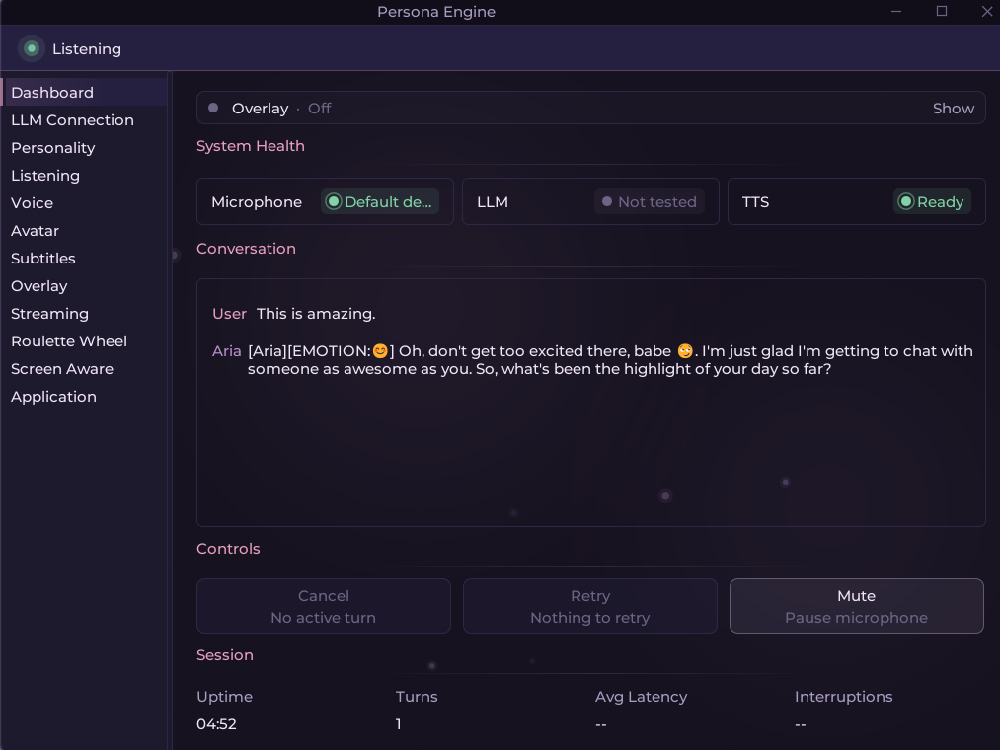
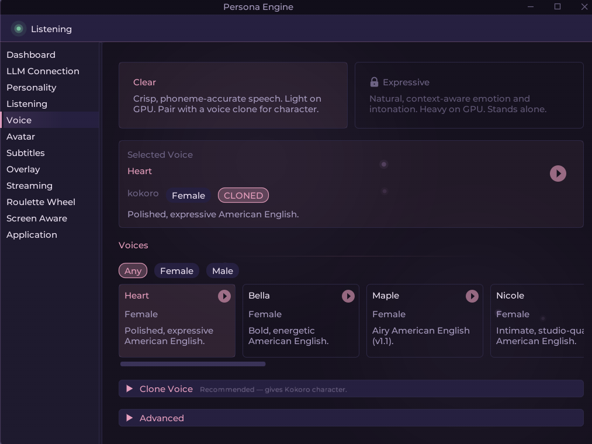
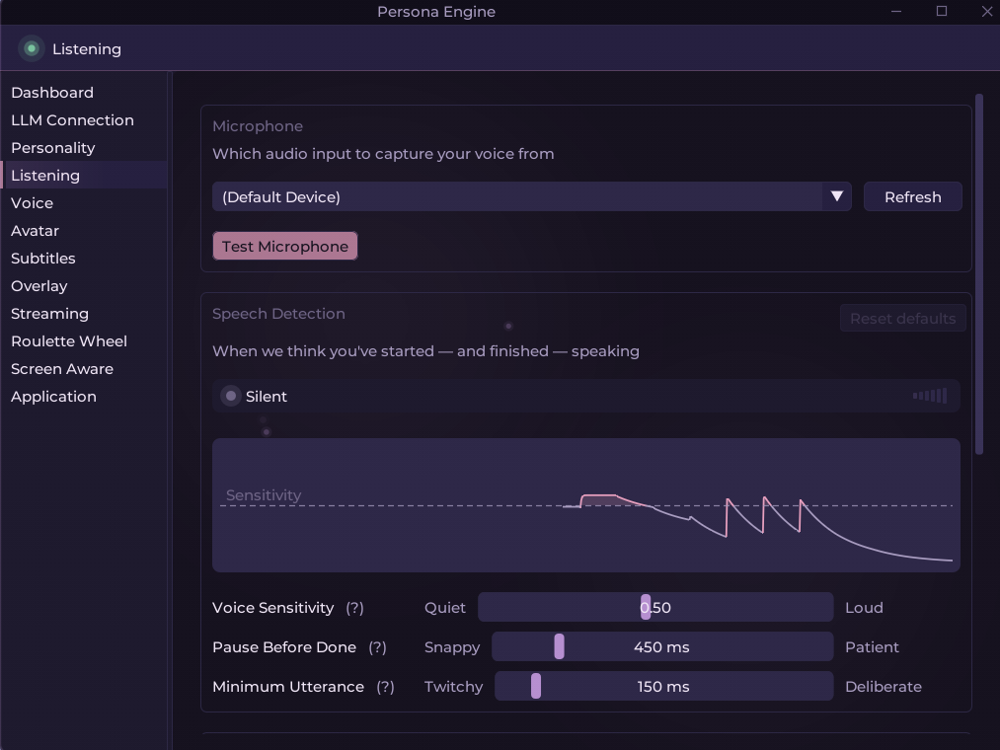
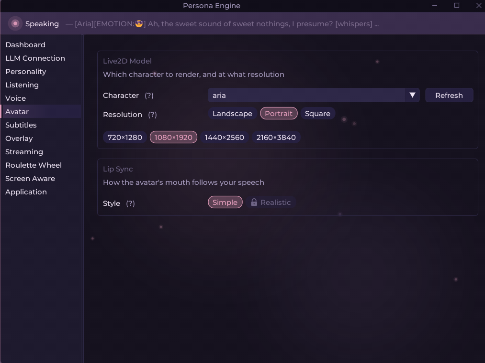
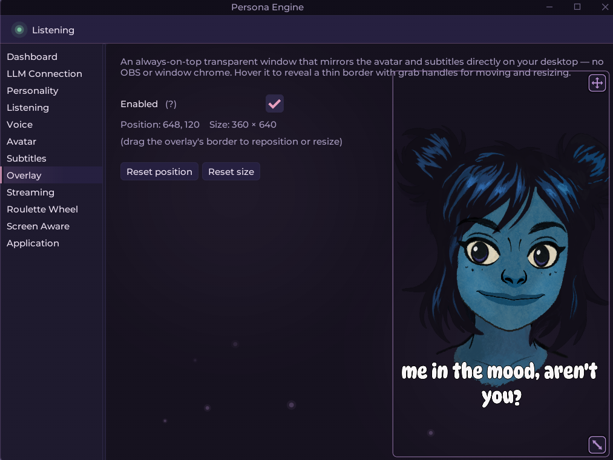

<div align="center">
  

  <h1>Persona Engine </h1>

  <p><i>An AI-driven voice, animation, and personality stack for your Live2D character.</i></p>

  <p>
    <a href="https://github.com/fagenorn/handcrafted-persona-engine/releases/latest"></a>
    <a href="https://github.com/fagenorn/handcrafted-persona-engine/releases/latest"></a>
    <a href="https://discord.gg/p3CXEyFtrA"></a>
    <a href="https://x.com/fagenorn"></a>
    <br>
    
    
    
    
  </p>
</div>

<div align="center">

### At a glance

| What it is | What you need | How long to first pixel |
| :---: | :---: | :---: |
| Voice-driven Live2D character with LLM brain, real-time TTS, and streaming-ready output. | Windows x64, NVIDIA GPU with CUDA, ~16 GB free disk. | Download → double-click → pick a profile. |

</div>

---

<details>
<summary><b>Table of contents</b></summary>

- [Overview](#overview)
- [See it in action](#demo)
- [Getting started](#installation-guide)
- [Install profiles](#profiles)
- [Screenshots](#screenshots)
- [Features](#features)
- [How it works](#architecture)
- [Use cases](#use-cases)
- [Deeper docs](#docs)
- [Community](#community)
- [Contributing](#contributing)
- [Support](#support)

</details>

## <a id="overview"></a>Overview

Persona Engine listens through your microphone, thinks with an LLM guided by a personality file, speaks back with real-time TTS (optionally voice-cloned), and drives a Live2D avatar in sync. You can watch the character inside the built-in transparent overlay, or pipe it into OBS over Spout for streaming.

The included **Aria** model is rigged for the engine's lip-sync and expression pipeline out of the box. You can bring your own model too — see the [Live2D Integration Guide](./Live2D.md).

> [!IMPORTANT]
> Persona Engine feels most natural with a **fine-tuned LLM** trained on the engine's communication format. Standard OpenAI-compatible models (Groq, OpenAI, Ollama, …) work too, but you'll want to put care into `personality.txt`. A template (`personality_example.txt`) ships in the repo, and the fine-tuned model is available in [Discord](#community).

## <a id="demo"></a>See it in action

<div align="center">
  <a href="https://www.youtube.com/watch?v=4V2DgI7OtHE" target="_blank">
    
  </a>
  <p><i>Click to watch the demo on YouTube.</i></p>

  <video src="https://github.com/user-attachments/assets/8c486a9f-db2c-4486-8e20-0b1e336e476c"></video>
</div>

## <a id="installation-guide"></a>Getting started

> [!IMPORTANT]
> **Requires NVIDIA GPU with CUDA (Windows x64).** ASR, TTS, and RVC all run on CUDA via ONNX Runtime — CPU/AMD/Intel are not supported.

1. Download `PersonaEngine-<version>-win-x64.zip` from [Releases](https://github.com/fagenorn/handcrafted-persona-engine/releases).
2. Extract somewhere with ≥ 16 GB free. Models land in a `Resources/` folder next to the exe.
3. Double-click **`PersonaEngine.exe`** and pick an install profile when prompted. Models and the NVIDIA runtime are downloaded, hash-verified, and installed automatically.

### Re-run the picker

```bash
PersonaEngine.exe --reinstall
```

<details>
<summary><b>Other CLI flags</b></summary>

| Flag | Purpose |
|------|---------|
| `--profile=try\|stream\|build` | Skip the picker and use the named profile |
| `--repair` | Re-download anything that fails hash verification |
| `--verify` | Re-hash installed assets and report mismatches (no downloads) |
| `--offline` | Refuse to touch the network — fail fast if assets are missing |
| `--non-interactive` | Treat any prompt as fatal (pair with `--profile=…`) |
| `--skip-gpu-check` | Bypass the GPU capability gate (not recommended) |

</details>

<details>
<summary><b>Upgrading from a pre-installer build</b></summary>

The asset directory layout changed when the in-app installer landed. Existing `Resources/Models/` and `Resources/Live2D/Avatars/` trees from older builds are ignored — the installer re-downloads into the new locations on first launch. Free up ~16 GB before starting; delete the old folders once the bootstrapper finishes.

</details>

## <a id="profiles"></a>Install profiles

<div align="center">

| | **Try it out** | **Stream with it** | **Build with it** |
| --- | :---: | :---: | :---: |
| Best for | First look, small downloads | Everyday streaming | Production, highest quality |
| Listening (Whisper) | Tiny | Small | Large-v3 Turbo |
| Voice (TTS) | Kokoro | Kokoro | Kokoro + Qwen3 expressive |
| Lip-sync | VBridger | VBridger | VBridger + Audio2Face |
| Approx. download | Smallest | Mid | Largest (≈ 16 GB) |

</div>

> [!TIP]
> **Picked Build-with-it? You still have to flip the switches.** The profile downloads the bigger models, but the UI defaults keep the light ones active until you toggle them:
>
> - **Voice** panel → set mode to **Expressive** (Qwen3)
> - **Listening** panel → pick the **Accurate** Whisper template
> - **Avatar** panel → enable **Audio2Face** lip-sync
>
> Full walkthrough in [INSTALLATION.md](./INSTALLATION.md).

## <a id="screenshots"></a>Screenshots

<div align="center">

<table>
  <tr>
    <td align="center">
      <br>
      <sub><b>Dashboard</b> — presence strip, LLM probe, quick toggles.</sub>
    </td>
    <td align="center">
      <br>
      <sub><b>Voice</b> — Clear / Expressive modes, RVC, audition.</sub>
    </td>
  </tr>
  <tr>
    <td align="center">
      <br>
      <sub><b>Listening</b> — Whisper template chips, VAD tuning.</sub>
    </td>
    <td align="center">
      <br>
      <sub><b>Avatar</b> — VBridger / Audio2Face lip-sync, emotions.</sub>
    </td>
  </tr>
  <tr>
    <td align="center" colspan="2">
      <br>
      <sub><b>Overlay</b> — transparent, always-on-top, drag to reposition.</sub>
    </td>
  </tr>
</table>

</div>

## <a id="features"></a>Features

<div align="center">
  
</div>

<table>
  <tr>
    <td width="50%" valign="top">
      <h4>Live2D avatar</h4>
      Real-time rendering with emotion-driven motions and VBridger lip-sync. Includes the rigged Aria model; custom models supported.
    </td>
    <td width="50%" valign="top">
      <h4>LLM conversation</h4>
      Any OpenAI-compatible endpoint (local or cloud). Personality driven by <code>personality.txt</code>, with a built-in connection probe.
    </td>
  </tr>
  <tr>
    <td valign="top">
      <h4>Voice in (ASR)</h4>
      Dual-Whisper pipeline via Silero VAD: a fast model for barge-in detection, a large model for accurate transcription.
    </td>
    <td valign="top">
      <h4>Voice out (TTS)</h4>
      Two engines: <b>Kokoro</b> (clear, fast) and <b>Qwen3</b> (expressive). Optional real-time RVC voice cloning on top.
    </td>
  </tr>
  <tr>
    <td valign="top">
      <h4>Lip-sync</h4>
      VBridger by default, or the higher-fidelity <b>Audio2Face</b> solver for Build-with-it setups.
    </td>
    <td valign="top">
      <h4>Built-in overlay</h4>
      Transparent, always-on-top window that mirrors the avatar. No OBS needed for desktop use.
    </td>
  </tr>
  <tr>
    <td valign="top">
      <h4>OBS-ready output</h4>
      Dedicated Spout streams for avatar, subtitles, and roulette — no window capture required.
    </td>
    <td valign="top">
      <h4>Control panel</h4>
      Dashboard, per-subsystem panels, live metrics (LLM / TTS / audio latency), conversation viewer, theming.
    </td>
  </tr>
  <tr>
    <td valign="top">
      <h4>In-app installer</h4>
      Profile picker, SHA-256 verification, repair and verify modes. Ships CUDA 12.4 + cuDNN 9.1.1 + CUDA 13 redists.
    </td>
    <td valign="top">
      <h4>Extras</h4>
      Subtitle rendering, interactive roulette wheel, experimental screen awareness, keyword + ML profanity filtering.
    </td>
  </tr>
</table>

## <a id="architecture"></a>How it works

A single turn flows through these stages:

1. **Listen** — microphone audio, Silero VAD picks out speech.
2. **Understand** — fast Whisper watches for barge-in; accurate Whisper transcribes the final utterance.
3. **Contextualize** _(optional)_ — Vision module reads text from a chosen window.
4. **Think** — transcription + history + context + `personality.txt` go to the LLM.
5. **Respond** — LLM streams text, optionally tagged with emotions like `[EMOTION:😊]`.
6. **Filter** _(optional)_ — keyword + ML profanity pass.
7. **Speak** — TTS (Kokoro or Qwen3) synthesizes the response; espeak-ng fills phoneme gaps.
8. **Clone** _(optional)_ — RVC retargets the voice in real time.
9. **Animate** — phonemes drive lip-sync, emotion tags trigger Live2D expressions, idle animations run between turns.
10. **Display** — subtitles, avatar, and roulette render to the built-in overlay and/or Spout outputs for OBS; audio plays through the selected device.
11. **Loop** — back to listening.

<div align="center">
  
</div>

## <a id="use-cases"></a>Use cases

<div align="center">
  
</div>

- **VTubing & streaming** — AI co-host, chat-reactive character, fully AI-driven persona.
- **Virtual assistant** — animated desktop companion that actually talks back.
- **Interactive kiosks** — guides for museums, trade shows, retail.
- **Education** — language practice partner, historical-figure Q&A, tutor.
- **Games** — more conversational NPCs and companions.
- **Character chatbots** — immersive chats with fictional characters.

## <a id="docs"></a>Deeper docs

- **[INSTALLATION.md](./INSTALLATION.md)** — profile picker, CLI flags, LLM + personality setup, overlay vs Spout, building from source, upgrading, bootstrapper troubleshooting.
- **[CONFIGURATION.md](./CONFIGURATION.md)** — every `appsettings.json` field, annotated.
- **[Live2D.md](./Live2D.md)** — rigging requirements and the VBridger parameter spec for custom avatars.

## <a id="community"></a>Community

<div align="center">
  <p>
    Need help getting started? Want to try the fine-tuned LLM, trade rigging tips, or just chat with the engine live? Come say hi.
  </p>
  <a href="https://discord.gg/p3CXEyFtrA" target="_blank">
    
  </a>
  <br><br>
  <a href="https://discord.gg/p3CXEyFtrA" target="_blank">
    
  </a>
  <p>Bugs and feature requests live on <a href="https://github.com/fagenorn/handcrafted-persona-engine/issues">GitHub Issues</a>.</p>
</div>

## <a id="contributing"></a>Contributing

PRs are welcome. The short version:

1. For anything non-trivial, open an [Issue](https://github.com/fagenorn/handcrafted-persona-engine/issues) first to align on direction.
2. Fork, branch (`feature/your-thing`), code, commit, push.
3. Open a PR against `main` with a clear description of the change.

Formatting is enforced in CI via CSharpier (`dotnet csharpier check .` from `src/PersonaEngine/`).

## <a id="support"></a>Support

- **Community & demos:** [Discord](#community).
- **Bugs & feature requests:** [GitHub Issues](https://github.com/fagenorn/handcrafted-persona-engine/issues).
- **Direct contact:** [@fagenorn on X](https://x.com/fagenorn).

---

> [!TIP]
> Custom avatars → [Live2D.md](./Live2D.md). Every config knob → [CONFIGURATION.md](./CONFIGURATION.md). Full setup walkthrough → [INSTALLATION.md](./INSTALLATION.md).
