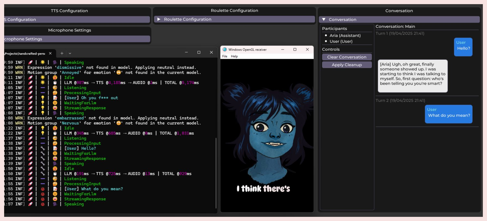
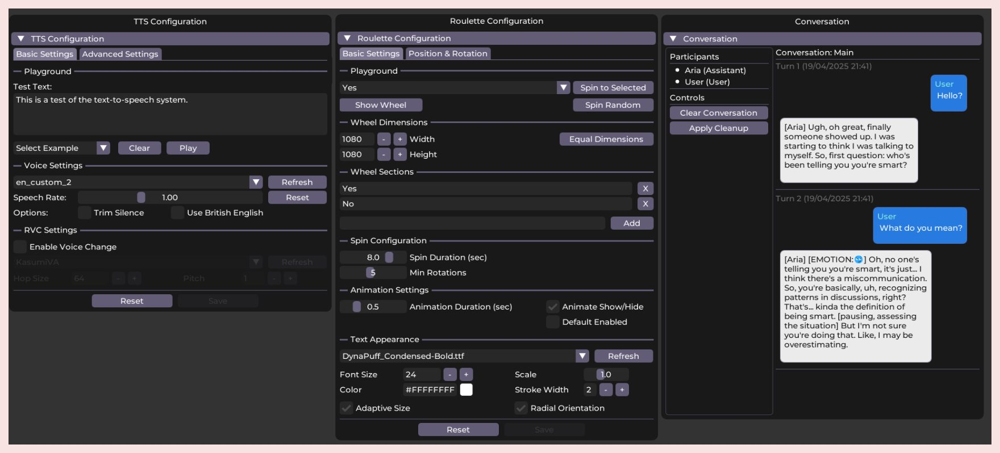

  <h1>
    ✨ Persona Engine  ✨
  </h1>

  
<i>Unleash your digital characters with the magic of AI-driven voice, animation, and personality!</i>

  
  &nbsp;&nbsp; 
  &nbsp;&nbsp; 

  ---

  

    <b>Persona Engine</b> is your all-in-one toolkit for creating captivating, interactive avatars! It masterfully combines:
     
    🎨 <b>Live2D:</b> For expressive, real-time character animation.
     
    🧠 <b>Large Language Models (LLMs):</b> Giving your character a unique voice and personality.
     
    🎤 <b>Automatic Speech Recognition (ASR):</b> To understand voice commands and conversation.
     
    🗣️ <b>Text-to-Speech (TTS):</b> Enabling your character to speak naturally.
     
    🎭 <b>Real-time Voice Cloning (RVC - Optional):</b> To mimic specific voice characteristics.
     
     
    Perfectly suited for <b>VTubing 🎬</b>, dynamic <b>streaming 🎮</b>, and innovative <b>virtual assistant applications 🤖</b>.
     
    <i>Let's bring your character to life like never before!</i> ✨
  

  

  <h2>💖 See it in Action! 💖</h2>
  
Witness the Persona Engine creating digital magic:

  
  
<i>(Click the image above to watch the demo!)</i>

   

  
And here's another little glimpse into what the friendly engine can do:

  <video src="https://github.com/user-attachments/assets/8c486a9f-db2c-4486-8e20-0b1e336e476c"></video>
    

## 📜 Table of Contents

* [🌸 Overview: What's Inside?](#overview)
* [🚀 Getting Started: Installation Guide](#installation-guide)
* [✨ Features Galore!](#features)
* [⚙️ Architecture / How it Works](#architecture)
* [💡 Potential Use Cases](#use-cases)
* [🤝 Contributing](#contributing)
* [🎭 Live2D Integration Guide](./Live2D.md)
* [💬 Join Our Community!](#community)
* [❓ Support & Contact](#support)

## 🌸 Overview: What's Inside?

Persona Engine listens to your voice 🎤, thinks using powerful AI language models 🧠 (guided by a personality you define!), speaks back with a synthesized voice 🔊 (which can optionally be cloned using RVC!), and animates a Live2D avatar 🎭 accordingly.

It integrates seamlessly into streaming software like OBS Studio using Spout for high-quality visual output. The included "Aria" model is specially rigged for optimal performance, but you can integrate your own Live2D models (see the [Live2D Integration Guide](./Live2D.md)).

> [!IMPORTANT]  
> Persona Engine achieves the most natural and in-character interactions when used with a **specially fine-tuned Large Language Model (LLM)**. This model is trained to understand the engine's specific communication format.
>
> While you *can* use standard OpenAI-compatible models (e.g., from Ollama, Groq, OpenAI), it requires careful **prompt engineering** within the `personality.txt` file. We provide a template (`personality_example.txt`) in the repository to guide you.
>
> **Detailed instructions for configuring `personality.txt` for standard models are crucial and can be found in the [Installation Guide](./INSTALLATION.md#configure-personality-txt---important).**
>
> 👉 Want to try the fine-tuned model or see a live demo? Hop into our [Discord](#community)! 😊

  <h3>Screenshots!</h3>
  
   <i>Look how helpful it is as a desktop friend! 😊</i>
    
  
   <i>Peek inside the engine's cozy control room! ✨</i>
    

## 🚀 Getting Started: Installation Guide

➡️ **Please follow the detailed [Installation and Setup Guide](./INSTALLATION.md) to install prerequisites, download models, configure, and run the engine.** ⬅️

**Key Requirements Covered:**
* **System:** **Mandatory NVIDIA GPU with CUDA support is required** for core features (ASR, TTS, RVC).
* **Software:** .NET Runtime, espeak-ng.
* **AI Models:** Downloading Whisper ASR models.
* **Live2D:** Setting up your Live2D model (using Aria or your own).
* **(Optional) RVC:** Real-time Voice Cloning setup.
* **LLM:** Configuring access to your chosen LLM (API keys, endpoints).
* **Streaming:** Setting up Spout output for OBS/other software.
* **Configuration:** Understanding `appsettings.json`.
* **Troubleshooting:** Common issues and solutions.

## ✨ Features Galore!

* 🎭 **Live2D Avatar Integration:**
    * Loads and renders Live2D models (`.model3.json`).
    * Includes the specially rigged "Aria" model.
    * Supports emotion-driven animations (`[EMOTION:name]`) and VBridger-standard lip-sync parameters.
    * Dedicated services for **Emotion**, **Idle**, and **Blinking** animations.
    * **See the detailed [Live2D Integration & Rigging Guide](./Live2D.md) for custom model requirements!**

* 🧠 **AI-Driven Conversation:**
    * Connects to OpenAI-compatible Large Language Model (`LLM`) APIs (local or cloud).
    * Guided by your custom `personality.txt` file.
    * Features **improved conversation context** and **session management** for more robust interactions.
    * Optimized for the optional special fine-tuned model (see [Overview](#overview)).

* 🗣️ **Voice Interaction (Requires NVIDIA `GPU`):**
    * Listens via microphone (using `NAudio`/`PortAudio`).
    * Detects speech segments using Silero `VAD`.
    * Understands speech using Whisper `ASR` (via `Whisper.NET`).
    * Includes dedicated **Barge-In Detection** to handle user interruptions more gracefully.
    * Uses a small, fast Whisper model for interruption detection and a larger, more accurate model for transcription.

* 🔊 **Advanced Text-to-Speech (`TTS`) (Requires NVIDIA `GPU`):**
    * Sophisticated pipeline: Text Normalization -> Sentence Segmentation -> Phonemization -> `ONNX` Synthesis.
    * Brings text to life using custom `kokoro` voice models.
    * Uses `espeak-ng` as a fallback for unknown words/symbols.

* 👤 **Optional Real-time Voice Cloning (`RVC`) (Requires NVIDIA `GPU`):**
    * Integrates `RVC` `ONNX` models.
    * Modifies the `TTS` voice output in real-time to sound like a specific target voice.
    * Can be disabled for performance.

* 📜 **Customizable Subtitles:**
    * Displays spoken text with configurable styling options via the `UI`.

* 💬 **Control `UI` & Chat Viewer:**
    * Dedicated `UI` window for monitoring engine status.
    * Viewing latency metrics (LLM, TTS, Audio)
    * Live adjustment of `TTS` parameters (pitch, rate) and Roulette Wheel settings.
    * View and edit the conversation history.

* 👀 **Screen Awareness (Experimental):**
    * Optional Vision module allows the AI to "see" and read text from specified application windows.

* 🎡 **Interactive Roulette Wheel (Experimental):**
    * An optional, configurable on-screen roulette wheel for interactive fun.

* 📺 **Streaming Output (`Spout`):**
    * Sends visuals (Avatar, Subtitles, Roulette Wheel) directly to OBS Studio or other `Spout`-compatible software.
    * Uses separate, configurable `Spout` streams (no window capture needed!).

* 🎶 **Audio Output:**
    * Plays generated speech clearly via `PortAudio`.

* ⚙️ **Configuration:**
    * Primary setup via `appsettings.json` (details in [Installation Guide](./INSTALLATION.md#configuration-appsettingsjson)).
    * Real-time adjustments for some settings via the Control `UI`.

* 🤬 **Profanity Filtering:**
    * Basic keyword list + optional Machine Learning (`ML`)-based filtering for `LLM` responses.

## ⚙️ Architecture / How it Works

Persona Engine operates in a continuous loop, bringing your character to life through these steps:

1.  **Listen:** 🎤
    * A microphone captures audio.
    * A Voice Activity Detector (VAD) identifies speech segments.

2.  **Understand:** 👂
    * A fast Whisper model detects potential user interruptions.
    * Once speech ends, a more accurate Whisper model transcribes the full utterance.

3.  **Contextualize (Optional):** 👀
    * If enabled, the Vision module captures text content from specified application windows.

4.  **Think:** 🧠
    * Transcribed text, conversation history, optional screen context, and rules from `personality.txt` are sent to the configured Large Language Model (LLM).

5.  **Respond:** 💬
    * The LLM generates a text response.
    * This response may include emotion tags (e.g., `[EMOTION:😊]`) or commands.

6.  **Filter (Optional):** 🤬
    * The response is checked against profanity filters.

7.  **Speak:** 🔊
    * The Text-to-Speech (TTS) system converts the filtered text into audio.
    * It uses a `kokoro` voice model primarily.
    * It falls back to `espeak-ng` for unknown elements.

8.  **Clone (Optional):** 👤
    * If Real-time Voice Cloning (RVC) is enabled, it modifies the TTS audio in real-time.
    * This uses an ONNX model to match the target voice profile.

9.  **Animate:** 🎭
    * Phonemes extracted during TTS drive lip-sync parameters (VBridger standard).
    * Emotion tags in the LLM response trigger corresponding Live2D expressions or motions.
    * Idle animations play when the character is not speaking to maintain a natural look.
    * **(See [Live2D Integration & Rigging Guide](./Live2D.md) for details!)**

10. **Display:**
    * 📜 Subtitles are generated from the spoken text.
    * 📺 The animated avatar, subtitles, and optional Roulette Wheel are sent via dedicated Spout streams to OBS or other software.
    * 🎶 The synthesized (and optionally cloned) audio is played through the selected output device.

11. **Loop:**
    * The engine returns to the listening state, ready for the next interaction.

 

 
 

## 💡 Potential Use Cases: Imagine the Fun!

* 🎬 **VTubing & Live Streaming:** Create an AI co-host, an interactive character responding to chat, or even a fully AI-driven VTuber persona.
* 🤖 **Virtual Assistant:** Build a personalized, animated desktop companion that talks back.
* 🏪 **Interactive Kiosks:** Develop engaging virtual guides for museums, trade shows, retail environments, or information points.
* 🎓 **Educational Tools:** Design an AI language practice partner, an interactive historical figure Q&A bot, or a dynamic tutor.
* 🎮 **Gaming:** Implement more dynamic and conversational Non-Player Characters (NPCs) or companion characters in games.
* 💬 **Character Chatbots:** Allow users to have immersive conversations with their favorite fictional characters brought to life.

## 🤝 Contributing

Contributions are highly welcome! If you have improvements, bug fixes, or new features in mind, please follow these steps:

1.  **Discuss (Optional but Recommended):** For major changes, please open a [GitHub Issue](https://github.com/fagenorn/handcrafted-persona-engine/issues) first to discuss your ideas.
2.  **Fork:** Fork the repository to your own GitHub account.
3.  **Branch:** Create a new feature branch for your changes (`git checkout -b feature/YourAmazingFeature`).
4.  **Code:** Make your changes. Please try to adhere to the existing coding style and add comments where necessary.
5.  **Commit:** Commit your changes with clear messages (`git commit -m 'Add some AmazingFeature'`).
6.  **Push:** Push your branch to your fork (`git push origin feature/YourAmazingFeature`).
7.  **Pull Request:** Open a Pull Request (PR) back to the `main` branch of the original repository. Describe your changes clearly in the PR.

Your help in making Persona Engine better is greatly appreciated! 😊

## 💬 Join Our Community!

Need help getting started? Have questions or brilliant ideas? 💡 Want to see a live demo, test the special fine-tuned model, or chat directly with a Persona Engine character? Having trouble converting RVC models or rigging your own Live2D model? Come say hi on Discord! 👋

   

 
 

You can also report bugs or request features via <a href="https://github.com/fagenorn/handcrafted-persona-engine/issues" target="_blank">GitHub Issues</a>.

## ❓ Support & Contact

* **Primary Support & Community:** Please join our [Discord Server](#community) for help, discussion, and demos.
* **Bug Reports & Feature Requests:** Please use [GitHub Issues](https://github.com/fagenorn/handcrafted-persona-engine/issues).
* **Direct Contact:** You can also reach out via [Twitter/X](https://x.com/fagenorn).

-----

> [!TIP]
> *Remember to consult the [Live2D Integration & Rigging Guide](./Live2D.md) for details on preparing custom avatars.*
> *For detailed setup steps, please refer to the [Installation and Setup Guide](./INSTALLATION.md).*
